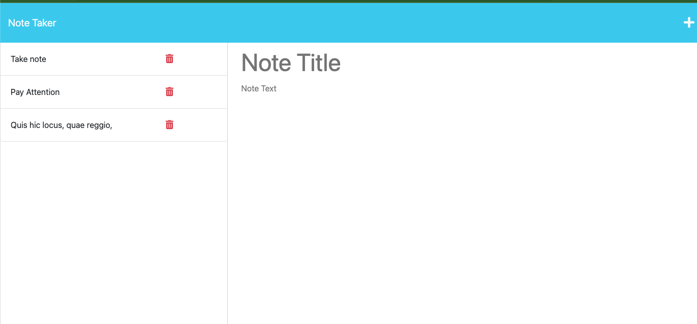
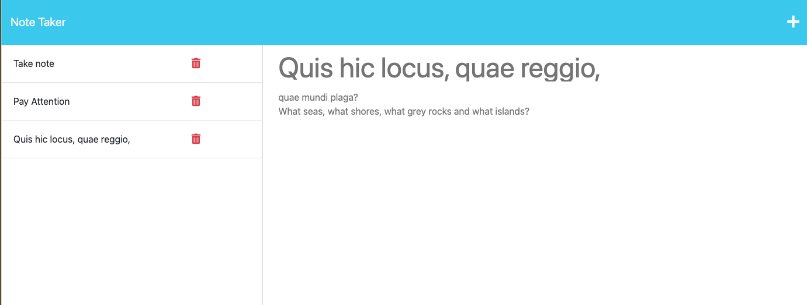
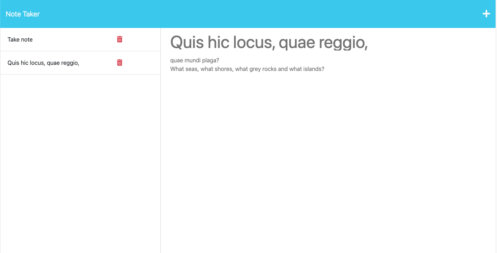

# EasyNotes

## a streamlined way to take notes! Save, delete, revisit any of your notes with this easy app.

## Table of Contents

- [Installation](#installation)
- [Usage](#usage)
- [Credits](#credits)
- [License](#license)
- [Questions](#questions)

## Installation

No need to install anything for this app, simply visit our site at [Easy-Notes](https://easy-notes-ce92918ef934.herokuapp.com/)

## Usage/Tests

In order to use this application, click the button to begin. Once you're on the notes page, type in a title and body in order to trigger the save button. Once you save your note, it will appear in the notes list. You can click your previous notes to view again, or delete them once finished.

## Contributing

The collaborators on this project include me, myself, and I -- tayskully

Tutorials followed include Columbia University EdX's Coding Bootcamp 2023, as well as:  
 [Github Docs](https://docs.github.com/en)  
 [developer mozilla](https://developer.mozilla.org/en-US/)  
 [Dev.to](https://dev.to/)  
 [Code Academy blogs](https://www.codecademy.com/resources/blog/)  
 [W3 Schools](https://www.w3schools.com/)

Special thanks to Erik Hirsch, my tutor, for the additional guidance

## License

    MIT License

## Questions

Reach out to me if you have any questions!

- Github: [tayskully](https://github.com/tayskully)
- LinkedIn: [taylordaniellesullivan](https://www.linkedin.com/in/taylordaniellesullivan/)
- Email: taysully94@gmail.com

---

## Badges

